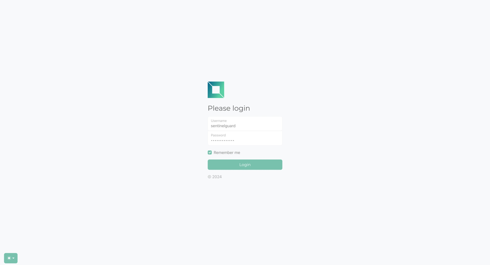
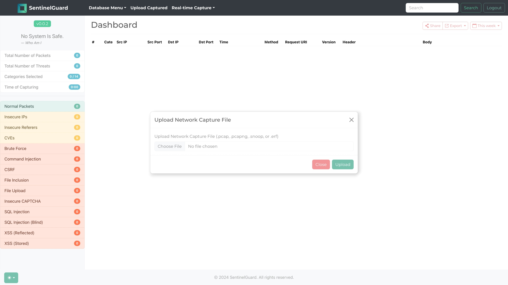
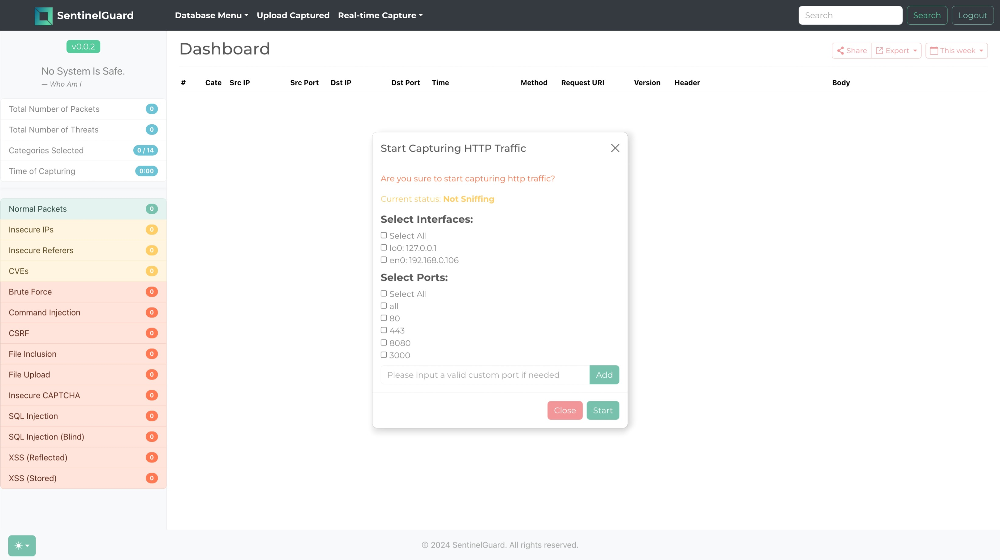
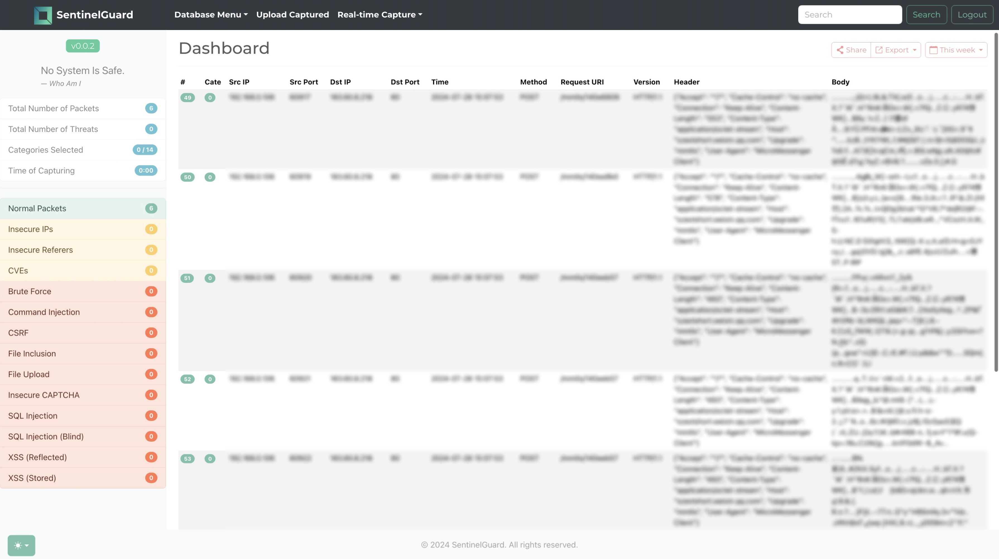
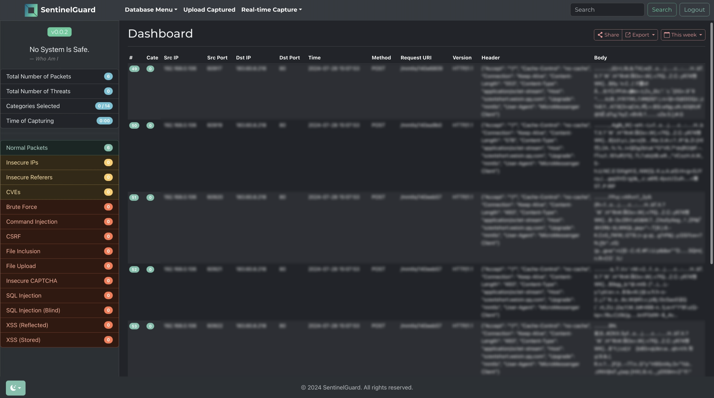

<p align="center">

</p>
<p align="center"><i>An Integrated Real-time HTTP Intrusion Detection System.</i></p>
<div align="center">
  <a href="https://github.com/zhsh9/SentinelGuard/stargazers"></a>
<a href="https://github.com/zhsh9/SentinelGuard/network/members"></a>
<a href="https://github.com/zhsh9/SentinelGuard/pulls"></a>
<a href="https://github.com/zhsh9/SentinelGuard/issues"></a>
<a href="https://github.com/zhsh9/SentinelGuard/graphs/contributors"></a>
<a href="https://github.com/zhsh9/SentinelGuard/blob/master/LICENSE"></a>
</div>

## Installation

- Flask3, Vue3, Bootstrap 5.3.3

```bash
cd frontend; yarn install
cd backend; pip install -r requirement.txt
```

## Configuration

- Backend: `./backend/config.py`
- Frontend: `./frontend/vue.config.js`

## Usage

```bash
python backend/app.py
cd frontend; npm run serve
cd frontend; yarn serve
```

## Screenshot

<table align="center" style="width: 100%; table-layout: fixed;">
  <tr>
    <td style="width: 33.33%; text-align: center; vertical-align: top;">
      
      <p>Login Page</p>
    </td>
    <td style="width: 33.33%; text-align: center; vertical-align: top;">
      
      <p>Upload Page</p>
    </td>
    <td style="width: 33.33%; text-align: center; vertical-align: top;">
      
      <p>Sniff Page</p>
    </td>
  </tr>
  <tr>
    <td style="width: 33.33%; text-align: center; vertical-align: top;">
      
      <p>Dashboard Light Theme</p>
    </td>
    <td style="width: 33.33%; text-align: center; vertical-align: top;">
      
      <p>Dashboard Dark Theme</p>
    </td>
  </tr>
</table>